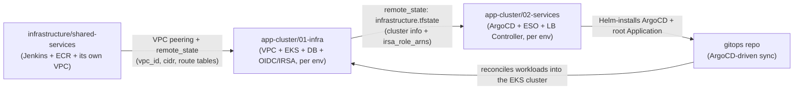
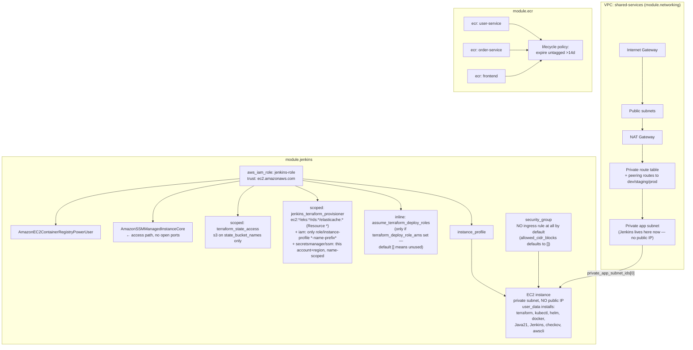
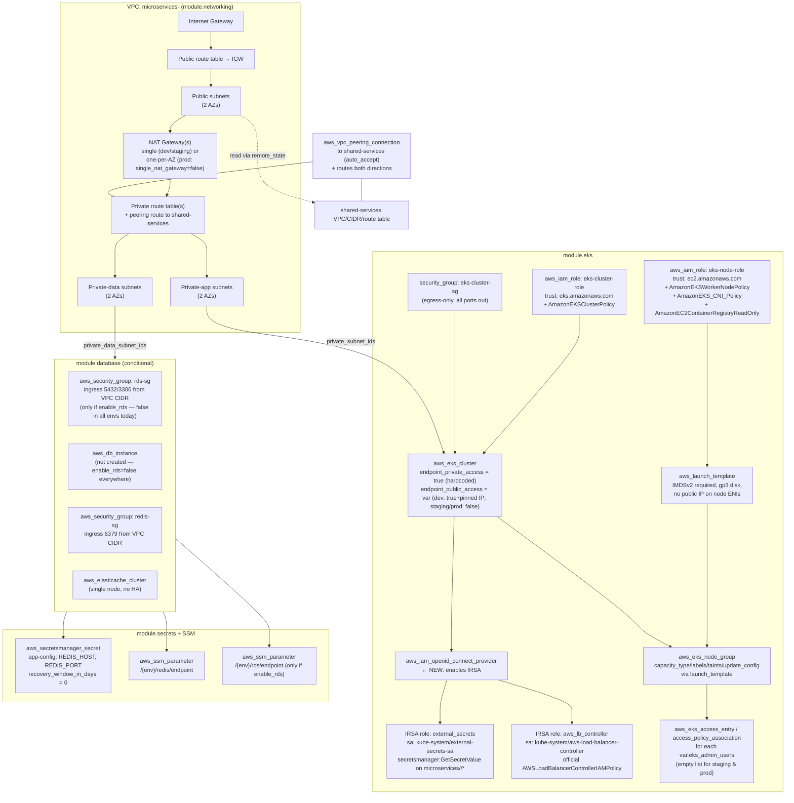
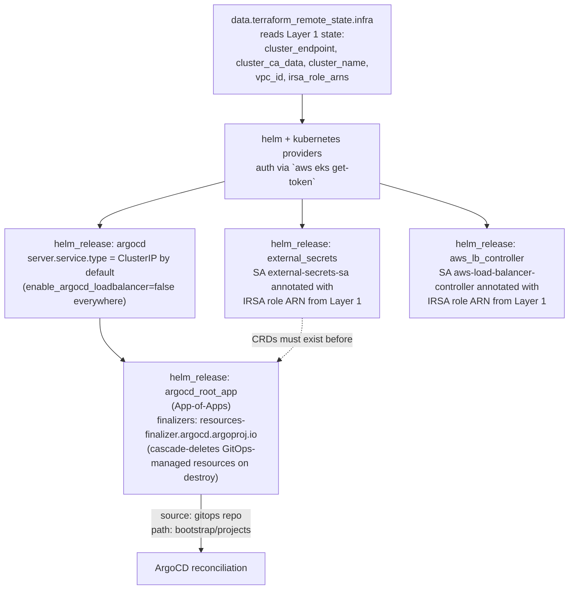
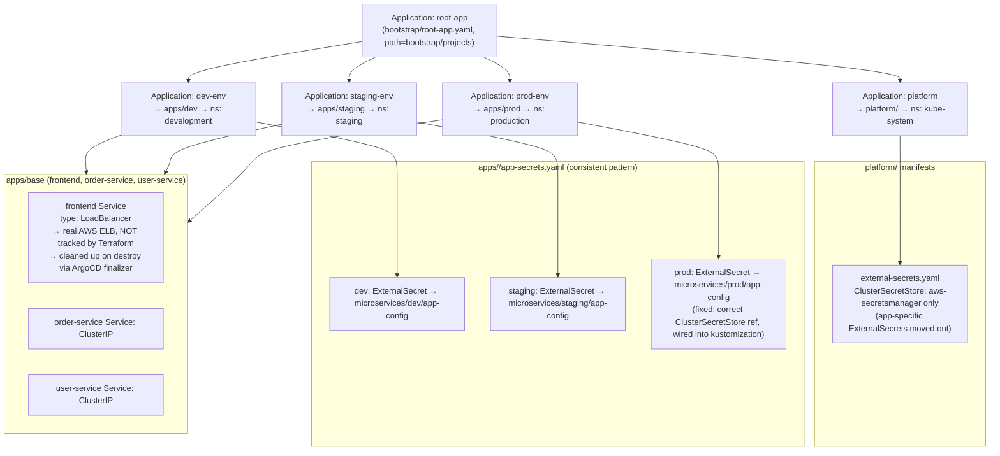
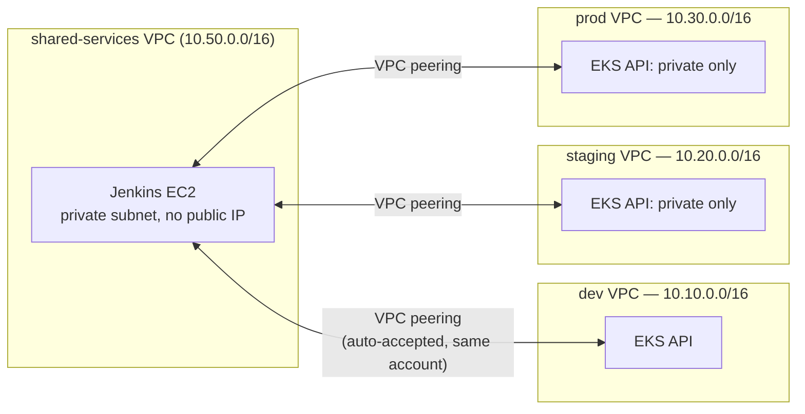

# Infrastructure Architecture — `tf` + `gitops` repos

Updated 2026-08-13 after a round of fixes (Jenkins/ArgoCD IAM scoping, OIDC/IRSA, VPC
peering, node hardening, secret/backend consistency, and removing Jenkins/ArgoCD from
public exposure). Covers what gets created, by which layer, and which IAM roles/policies
attach to what, for every apply/boot path: `shared-services`, `app-cluster`
(`dev` / `staging` / `prod`), and the GitOps sync that follows.

---

## 1. Overall layering

There are **three independent Terraform root modules**, applied in this order by
[`tf/Jenkinsfile`](tf/Jenkinsfile), plus a GitOps layer that ArgoCD drives after Layer 2:

`shared-services` is applied **once, first** — every environment's Layer 1 peers to it and
reads its VPC info via remote state. `01-infra`/`02-services` are then applied per
environment (`dev`, `staging`, `prod`), each with its own VPC and its own S3 state key.

---

## 2. `shared-services` apply (Jenkins + ECR)

File: [`tf/infrastructure/shared-services/main.tf`](tf/infrastructure/shared-services/main.tf)

**Key facts**
- Jenkins now lives in shared-services' **private** subnet with **no public IP** and no
  open inbound security-group rule by default. Access is via
  `aws ssm start-session` (see `tf/README.md`, "Step 4").
- Jenkins' IAM role is scoped: broad-but-bounded `ec2:*/eks:*/rds:*/elasticache:*` (needed
  for full provisioning lifecycle), but `iam:*`/`secretsmanager:*`/`ssm:*` are all
  restricted to this project's name prefix and this account/region — no more
  `Resource: "*"` account-wide admin.
- `AmazonSSMManagedInstanceCore` replaces the old open-SSH access path.
- `allowed_cidr_blocks` (default `[]`) can still be set to a VPN/office CIDR if a direct
  network path is ever wanted instead of SSM.

---

## 3. `app-cluster/01-infra` apply (per environment: dev / staging / prod)

File: [`tf/infrastructure/app-cluster/01-infra/main.tf`](tf/infrastructure/app-cluster/01-infra/main.tf)

**Key facts**
- Every environment still gets its **own VPC**, but is now **peered to shared-services**
  (auto-accepted, same-account) so Jenkins has a private network path to each cluster's API
  regardless of `eks_endpoint_public_access`.
- An **OIDC provider** is now registered for the cluster, with a generic `irsa_roles` map
  that creates one scoped IAM role per in-cluster controller (currently
  `external_secrets` and `aws_lb_controller`) — no more permissions borrowed from the node
  role.
- The node group now launches through a **launch template enforcing IMDSv2**, with
  configurable disk size/capacity type/labels/taints/update_config.
- Prod sets `single_nat_gateway = false` — one NAT gateway per AZ instead of a single-AZ
  dependency; dev/staging keep the cheaper single-NAT default.
- `bootstrap_cluster_creator_admin_permissions = true` still means the Terraform-apply
  identity (Jenkins) is always a cluster admin; `eks_admin_users` remains empty for
  staging/prod (add real admin ARNs there if/when needed).

---

## 4. `app-cluster/02-services` apply (ArgoCD + platform add-ons, per environment)

File: [`tf/infrastructure/app-cluster/02-services/main.tf`](tf/infrastructure/app-cluster/02-services/main.tf)

**Key facts**
- ArgoCD's Service is **ClusterIP by default** in dev/staging/prod — access via
  `kubectl port-forward` (direct for dev, tunneled through Jenkins/SSM for staging/prod,
  since their EKS APIs are private-only). See `tf/README.md` Step 4.
- **External Secrets Operator** and the **AWS Load Balancer Controller** are now actually
  installed here (previously only referenced, never installed, in the gitops repo) — each
  with its own IRSA role from Layer 1, annotated onto the chart's ServiceAccount.
- `argocd_root_app` still carries the cascade-delete finalizer so `terraform destroy`
  cleans up everything ArgoCD deployed (e.g. the `frontend` LoadBalancer's AWS ELB) before
  Layer 1 tears down the VPC/NAT/subnets.

---

## 5. GitOps sync (ArgoCD reconciliation, driven from the `gitops` repo)

**Key facts**
- The AWS Load Balancer Controller placeholder (`aws-lb-controller.yaml`) is **removed** —
  the real controller is installed via Terraform/Helm in `02-services` instead (it needs an
  IRSA role only Terraform can create).
- Every environment now follows the **same** `apps/<env>/app-secrets.yaml` pattern, pulling
  from the `microservices/<env>/app-config` Secrets Manager secret that Terraform's
  `modules/secrets` actually creates — no more inconsistent per-env approaches or dangling
  references to secrets/parameters that don't exist.
- `frontend`'s Service is still the one AWS-managed (not Terraform-tracked) resource in the
  whole stack — its lifecycle is now handled correctly by the ArgoCD finalizer on destroy.

---

## 6. Network topology & destroy-time dependency chain

Destroy order enforced by `tf/Jenkinsfile` (Layer 2 → Layer 1) is correct, and the ArgoCD
cascade-delete finalizer (§4) now ensures GitOps-managed AWS resources (the `frontend` ELB)
are cleaned up before Layer 1 tries to delete the NAT Gateway/subnets — the original
destroy failure this document was written to diagnose. Jenkins can now reach every
environment's EKS API over private networking regardless of public endpoint access,
closing the network-isolation gap that existed before this round of fixes.

---

## 7. IAM / trust summary

| Role | Trust | Attached / effective permissions | Where |
|---|---|---|---|
| `jenkins-role` | `ec2.amazonaws.com` | ECR PowerUser + SSM Managed Instance Core + scoped S3 (state buckets only) + `ec2:*/eks:*/rds:*/elasticache:*` + name/account/region-scoped `iam:*`/`secretsmanager:*`/`ssm:*` | `modules/jenkins/main.tf` |
| `eks-cluster-role` | `eks.amazonaws.com` | `AmazonEKSClusterPolicy` | `modules/eks/main.tf` |
| `eks-node-role` | `ec2.amazonaws.com` | `AmazonEKSWorkerNodePolicy`, `AmazonEKS_CNI_Policy`, `AmazonEC2ContainerRegistryReadOnly` | `modules/eks/main.tf` |
| `irsa-external_secrets` | OIDC-federated (`system:serviceaccount:kube-system:external-secrets-sa`) | `secretsmanager:GetSecretValue`/`DescribeSecret` on `microservices/<env>/*` | `modules/eks/main.tf` (via `irsa_roles`) |
| `irsa-aws_lb_controller` | OIDC-federated (`system:serviceaccount:kube-system:aws-load-balancer-controller`) | Official `AWSLoadBalancerControllerIAMPolicy` | `modules/eks/main.tf` (via `irsa_roles`) |
| Cluster admin | via `bootstrap_cluster_creator_admin_permissions=true` | Always the Terraform-apply identity (Jenkins role); `eks_admin_users` adds more, but is `[]` for staging/prod | `modules/eks/main.tf` |

---

## 8. Public exposure (current state)

| Component | Exposure | Access path |
|---|---|---|
| Jenkins | None — no public IP, no open inbound port by default | `aws ssm start-session` (see `tf/README.md` Step 4) |
| ArgoCD UI | None — `ClusterIP` by default in every environment | `kubectl port-forward`, direct for dev, tunneled through Jenkins for staging/prod |
| EKS API (dev) | Public, pinned to one CIDR | Direct, if your IP matches `eks_public_access_cidrs` |
| EKS API (staging/prod) | Private only | Via the shared-services peering, from Jenkins or anything else inside that network |
| `frontend` app Service | Public (`type: LoadBalancer`) | Its own AWS ELB hostname — see `gitops/README.md` |

See `tf/README.md`, "Step 5: Granting Roles/Policies, and Making Things Public," for how to
deliberately re-open any of the above, or grant a new service its own scoped access.
